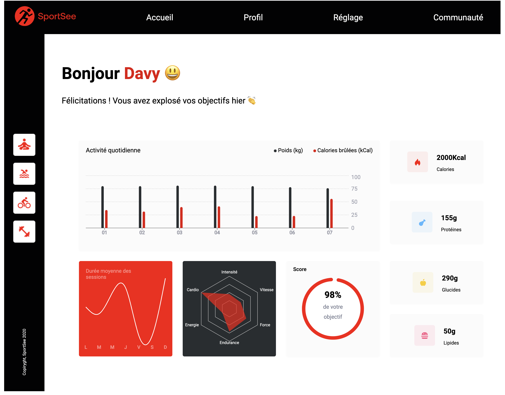

# Démarrage avec Create React App

Ce projet a été créé à l'aide de Create React App. [Create React App](https://github.com/facebook/create-react-app).

## Scripts Disponibles

Dans le répertoire du projet, vous pouvez exécuter :

### `npm start`

Lance l'application en mode développement.\
Ouvrez [http://localhost:3000](http://localhost:3000) dans votre navigateur pour le visualiser.
## Introduction

Ce projet utilise deux sources de données pour alimenter ses fonctionnalités : les données simulées (mocks) et les données provenant d'une API.
## Sources de Données

### 1. Mocks
Les données simulées sont installées directement dans l'application côté front-end. Elles sont utilisées principalement pour le développement et la démo. Les fichiers correspondants se trouvent dans le dossier `mocks`.

- **userMainData.json:** Contient les informations principales de l'utilisateur.
- **userActivity.json:** Contient les données d'activité de l'utilisateur.
- **userAverageSessions.json:** Contient les sessions moyennes de l'utilisateur.
- **userPerformance.json:** Contient les données de performance de l'utilisateur.

La source de données Mock est implémentée dans le fichier `MockSource.js`.

### 2. API

Les données provenant d'une API sont atteignables par les endpoints suivants :

- `http://localhost:5500/user/${userId}` : Informations détaillées de l'utilisateur.
- `http://localhost:5500/user/${userId}/activity` : Données d'activité de l'utilisateur.
- `http://localhost:5500/user/${userId}/average-sessions` : Sessions moyennes de l'utilisateur.
- `http://localhost:5500/user/${userId}/performance` : Données de performance de l'utilisateur.

La source de données API est implémentée dans le fichier `ApiSource.js`. L'URL de base de l'API est configurable via la variable d'environnement `REACT_APP_BASE_URL` dans le fichier `.env`.

## Points d'Accès en détails (Endpoints)

### 1.  Points d'Accès Possibles

Ce projet propose quatre points d'accès que vous pouvez utiliser :

1. **Informations Utilisateur:**
   - Endpoint: `http://localhost:5500/user/${userId}`
   - Description : Récupère les informations d'un utilisateur, incluant l'identifiant de l'utilisateur, les informations de l'utilisateur (prénom, nom, et âge), le score du jour en cours (todayScore), et les données clés (calories, macronutriments, etc.).

2. **Activité Utilisateur:**
   - Endpoint: `http://localhost:5500/user/${userId}/activity`
   - Description : Récupère l'activité quotidienne d'un utilisateur avec les kilogrammes et les calories.

3. **Sessions Moyennes:**
   - Endpoint: `http://localhost:5500/user/${userId}/average-sessions`
   - Description : Récupère les sessions moyennes d'un utilisateur par jour. La semaine commence le lundi.

4. **Performance Utilisateur:**
   - Endpoint: `http://localhost:5500/user/${userId}/performance`
   - Description : Récupère les métriques de performance d'un utilisateur (énergie, endurance, etc.).

**Attention:** Actuellement, seuls deux utilisateurs ont été simulés avec les identifiants d'utilisateur 12 et 18, respectivement.

### 2. Exemples de Requêtes

1. Récupérer la performance de l'utilisateur avec l'identifiant 12 :
   - Exemple de Requête :  `http://localhost:5500/user/12/performance`

2. Récupérer les informations principales de l'utilisateur 18 :
   - Exemple de Requête :  `http://localhost:5500/user/18`
